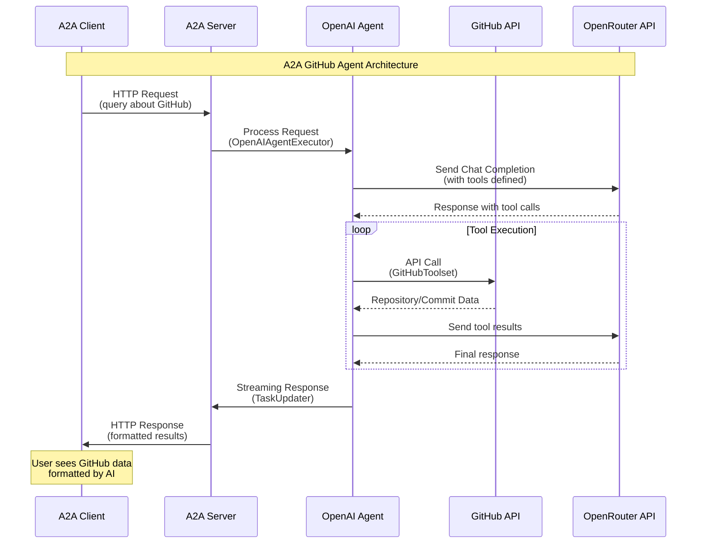

# A2A GitHub Agent

An intelligent GitHub agent built with A2A (Agent-to-Agent) SDK that can query GitHub repositories, recent updates, commits, and project activity using natural language.

## 🏗️ Architecture

This project implements an A2A Server that uses an OpenAI-based agent with GitHub API integration. The architecture consists of the following key components:

### Component Overview

- **A2A Server** (`__main__.py`): The main server application that handles HTTP requests and manages agent lifecycle
- **OpenAI Agent Executor** (`openai_agent_executor.py`): Executes agent tasks with OpenRouter API integration
- **GitHub Toolset** (`github_toolset.py`): Provides GitHub API tools for repository operations
- **Agent Definition** (`openai_agent.py`): Defines the agent's capabilities and system prompt

### Architecture Flow



## 🔧 Key Modules Logic

### 1. Main Server (`__main__.py`)
- Initializes the A2A server with Starlette framework
- Creates an `AgentCard` that defines the agent's capabilities and skills
- Sets up the OpenAI agent executor with GitHub tools
- Starts the HTTP server on the specified host and port

### 2. GitHub Toolset (`github_toolset.py`)
Provides three main GitHub API functions:
- **`get_user_repositories()`**: Retrieves recent repositories for a user
- **`get_recent_commits()`**: Fetches recent commits for a specific repository
- **`search_repositories()`**: Searches for repositories with recent activity

All functions include error handling and support optional parameters for filtering.

### 3. OpenAI Agent Executor (`openai_agent_executor.py`)
- Manages the conversation flow with OpenRouter API
- Converts GitHub tools to OpenAI function calling format
- Handles tool execution and response streaming
- Implements iterative conversation with tool calls

### 4. Agent Definition (`openai_agent.py`)
- Creates the agent with system prompt and available tools
- Defines the agent's behavior for GitHub-related queries
- Configures the agent to provide helpful repository information

## 📋 Prerequisites

- **Python 3.10 or higher**
- **[UV](https://docs.astral.sh/uv/)** - Python package manager
- **OpenRouter API Key** - For AI capabilities
- **GitHub Personal Access Token** (optional, but recommended for higher rate limits)

## 🚀 Step-by-Step Setup and Running

### Step 1: Clone and Setup Environment

```bash
# Clone the repository
git clone https://github.com/sing1ee/a2a-py-github-agent.git
cd a2a-py-github-agent

# Create virtual environment
uv venv
source .venv/bin/activate  # On Windows: .venv\Scripts\activate
```

### Step 2: Install Dependencies

```bash
# Install dependencies using UV
uv sync
```

### Step 3: Configure Environment Variables

Create a `.env` file in the project root:

```bash
# OpenRouter API Key (required)
echo "OPENROUTER_API_KEY=your_openrouter_api_key_here" > .env

# GitHub Personal Access Token (optional but recommended)
echo "GITHUB_TOKEN=your_github_personal_access_token_here" >> .env
```

**Note**: The GitHub token is optional. Without it, the agent will use unauthenticated access with limited rate limits (60 requests per hour vs 5000 with token).

### Step 4: Run the A2A Server

```bash
# Activate virtual environment
source .venv/bin/activate

# Run the server
uv run .
```

The server will start on `http://localhost:10007` by default.


## 🧪 Client Testing

### Option 1: Using A2A Movie Agent Client

You can test the GitHub agent using the A2A Movie Agent client:

```bash
# Clone the A2A Movie Agent client
git clone https://github.com/sing1ee/a2a-js-movie-agent.git
cd a2a-js-movie-agent

# Install dependencies
bun install

# Connect to your GitHub agent
bun cli http://localhost:10007
```

This will start an interactive CLI that connects to your GitHub agent server.

### Option 2: Using Direct HTTP Requests

You can also test using curl or any HTTP client:

```bash
# Example: Test with a simple query
curl -X POST http://localhost:10007/tasks \
  -H "Content-Type: application/json" \
  -d '{
    "input": {
      "text": "Show my recent repository updates"
    }
  }'
```

## 💡 Example Queries

The GitHub Agent can handle queries like:

- **Recent Commits**: "Show recent commits for repository 'facebook/react'"
- **Repository Search**: "Search for popular Python repositories with recent activity"
- **Project Activity**: "What are the latest updates in machine learning repositories?"

## 🔑 GitHub Token Setup

To create a GitHub Personal Access Token for better rate limits:

1. Go to [GitHub Settings > Tokens](https://github.com/settings/tokens)
2. Click "Generate new token (classic)"
3. Select the following scopes:
   - `repo` - Access to repositories
   - `user` - Access to user information
4. Copy the token and add it to your `.env` file

## 🛠️ Configuration Options

### Server Configuration

You can customize the server using command-line options:

```bash
# Custom host and port
uv run . --host=0.0.0.0 --port=10007
```

### Environment Variables

- `OPENROUTER_API_KEY`: Your OpenRouter API key (required)
- `GITHUB_TOKEN`: GitHub Personal Access Token (optional)

## 📖 API Documentation

### Available Tools

1. **get_user_repositories**
   - Get user's repositories with recent updates
   - Parameters: `username` (optional), `days` (default: 30), `limit` (default: 10)

2. **get_recent_commits**
   - Get recent commits for a repository
   - Parameters: `repo_name` (required), `days` (default: 7), `limit` (default: 10)

3. **search_repositories**
   - Search for repositories with recent activity
   - Parameters: `query` (required), `sort` (default: 'updated'), `limit` (default: 10)


## 📄 License

This project is licensed under the MIT License - see the LICENSE file for details.

## 🔗 Related Projects

- [A2A SDK](https://github.com/google-a2a/a2a-python) - The underlying A2A protocol implementation
- [A2A Movie Agent](https://github.com/sing1ee/a2a-js-movie-agent) - A movie information agent built with A2A protocol